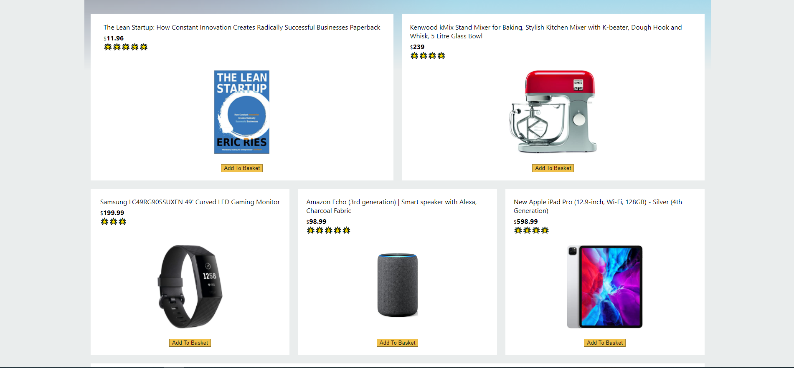
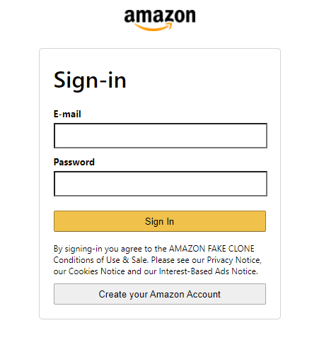
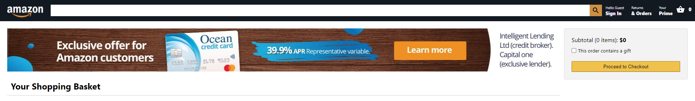

<h1 align="center">
  
   
  Amazon Clone Built Using React.JS & Firebase
</h1>

  This is a clone of Amazon website built using <strong><em>React.JS</em></strong> for Frontend and <strong><em>Firebase</em></strong> for Backend. It's a fully functional clone it has almost all the features of Amazon website. It's a project to show my Front-end & Back-end abilities in React.JS. It contains the Home Page, Sign In Page and the Shopping Basket Page.
     
  <strong><em>This is the live version:</em></strong> https://clone-65f16.web.app/

# Home Page
  
  The Home Page contains a logo that redirects you to home page, items, a search bar, sign in and basket buttons.
  All the items has Add To Basket button that adds selected item to your basket.
  
 

   
   

# Sign In Page

User auth with Firebase.

 

   

# Shopping Basket Page

The Shopping Basket page contains all the items that the user adds to basket. When the user adds items to the basket it sums the items prices and gives you a total price. Each item in Shopping Basket has a remove from basket button that removes the item and makes the total price go down.

 

   
   

