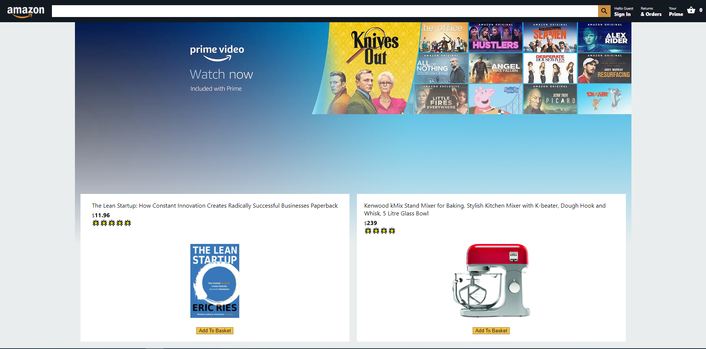

<h1 align="center">
  
   
  Amazon Clone Built Using React.JS & Firebase
</h1>

  This is a clone of Amazon website built using <strong><em>React.JS</em></strong> for Frontend and <strong><em>Firebase</em></strong> for Backend. It's a fully functional clone it has almost all the features of Amazon website. It's a project to show my Front-end & Back-end abilities in React.JS. It contains the Home Page, Sign In Page and the Shopping Basket Page.
     
  <strong><em>This is the live version:</em></strong> https://clone-65f16.web.app/

# Home Page
  
 

   

